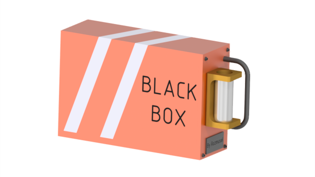

# Black Box



Телеграмм бот для хранения лекций и семинаров и получения доступа к ним

Бот размещён [здесь](https://t.me/RZM_Black_box_bot)

## Использование
Новым пользователем нужно пройти регистрацию в боте, чтобы получить доступ к учебным материалам. По окончанию регистрации пользователю предоставляется базовый уровень доступа к боту. Базовый доступ включает скачивание любых файлов по одному с вотермаркой и после задержки в 5 минут. Премиум пользователи имеют доступ к следующим функциям:

* Удаление вотермарок
* Быстрая загрузка
* Возможность выбора интервала лекций
* Подписки на предметы
* Уведомления об изменённых материалах
* Альтернативный способ загрузки

## Главное меню
Чтобы открыть главное меню введите отправьте команду /start (эта команда также находится в меню у бота для быстрого доступа)

Предоставляет возможность перейти к выбору лекций/семинаров или открыть настройки.

При использовании бота по мере скачиваний файлов рекомендуется вызывать команду /start из меню чтобы опускать главное меню вниз

### Лекции/семинары
Открывают список предметов, которые были загружены администратором филиала, который вы выбрали. После выбора предмета открывается список загруженных файлов, разделённых по лекциям. Премиум пользователи могут скачать интервал лекций или семинаров или сразу все по выбранному предмету.

### Настройка
Открывается меню настройки. Также выводится текущий уровень доступа и ссылка на личную папку на яндекс диске, если она есть.

#### Альтернативная загрузка
При включении данного режима, запрашиваемые файлы будут загружаться в вашу персональную папку на яндекс диске. Бот будет присылать ссылку на яндекс диск для каждого файла. В меню настроек можно перейти по ссылке на вашу папку и увидеть все загруженные файлы

#### Подписка
При активации, в меню загрузки предметов появится кнопка подписки, после нажатии которой вам будут автоматически высылаться новые файлы по этому предмету, как только они будут загружены

#### Уведомления
Данный параметр отвечает за уведомления об изменениях в скачанных вами ранее файлах. Если он активирован, вы получите новую версию файла.

#### Филиалы
Для пользователей уровня доступа ниже администратора предоставляется возможность выбрать филиал бота. Филиалы имеют свои собственные списки предметов, но они могут частично совпадать, поэтому для администраторов в этой вкладке появляется возможность открыть доступ своему филиалу к предмету из соседнего филиала.

#### Отзывы
Находясь в данной вкладке любое отправленное сообщение попадёт в файл с отзывами.

#### Премиум
В этой вкладке можно приобрести премиум доступ к боту за денюжку.

### Администраторская
Данная панель доступна только для администраторов филиалов.

#### Удаление последнего файла
Вкладка позволяет удалить последний загруженных файл по любому предмету

Кроме того администраторы могут изменять ранее загруженные файлы. Для изменения ранее загруженного файла отправьте его вновь, но в текстовом поле перед отправкой укажите номер замены.

Производить замену не обязательно находясь в данном меню.

#### Логи
В данной вкладке можно выбрать и скачать интересующий лог относящийся к работе телеграмм бота.

## Статус
- [x] Локальный ТГ сервер
- [x] Регистрация пользователей
- [x] Загрузка материалов
- [x] Скачивание размещённых материалов
- [x] Скачивание интервалов и полного списка
- [x] Настройки
- [x] Администраторская
- [x] Альтернативная загрузка (ссылка на Яндекс диск)
- [x] Оплата премиум подписки

## Запуск
Убедитесь что у вас установлены следующие переменные среды:
VCPKG_ROOT - указывает на установленный репозиторий vcpkg
TELEGRAM_BOT_TOKEN - токен телеграмм бота полученный из BotFather
TELEGRAM_PAYMENT_PROVIDER_TOKEN - токен необходимый для проведения оплат, тоже из BotFather
YADISK_TOKEN - токен для работы с яндекс диском (я использовал с доступом работы в папке приложения)

### Windows
```shell
vcpkg install
cmake --preset windows
cmake --build build
```
### Linux
```shell
vcpkg install
cmake --preset linux
cmake --build build
```

### Сервер
Инструкция по [сборке](https://tdlib.github.io/telegram-bot-api/build.html)

[Получение](https://my.telegram.org/apps) api id и api hash

Если возникают ошибки при попытке получить api id и api hash
1. Отключить VPN
2. Открыть файл C:\Windows\System32\drivers\etc\hosts
3. Добавить строку в конец файла 149.154.167.220 my.telegram.org
4. Сохранить файл
5. Перезапустить браузер

Запускать сервер командой:

```
telegram-bot-api --local --api-id=<api_id> --api-hash=<api_hash> --dir=<path_to_files>
```

## Лицензии зависимостей

Проект использует сторонние библиотеки. Тексты их лицензий и уведомления об авторских правах находятся в каталоге [LICENSES](LICENSES/):

* `tgbot-cpp` — MIT
* `SQLiteCpp` — MIT
* `spdlog` — MIT
* `yandex-disk-cpp-client` — MIT
* `PoDoFo` — LGPL-2.0
* `cURL` и `nlohmann-json` — лицензии указаны в соответствующих файлах каталога `LICENSES`

